# WEEK 5 RevoU Milestone 1!

 
## Hello I'm Hilmy Rasyad

Welcome to the Milestone 1 Project. This repository is about self branding and simple portfolio, check out the website 

[hilmyrasyad.site](hilmyrasyad.site)or by click [here](hilmyrasyad.site). 

Thank you so much for stopping by 

## Structure

This simple website contains :
- HTML
- CSS
- JS
- Assets

## Project Documentation

The documentation in making this project is divided into two, documentation in making website pages, and the deployment process.

<h3>Building The Page</h3>

1.First thing to do is clone the Repository and start setting the repo
2.Designing the layout and details in figma
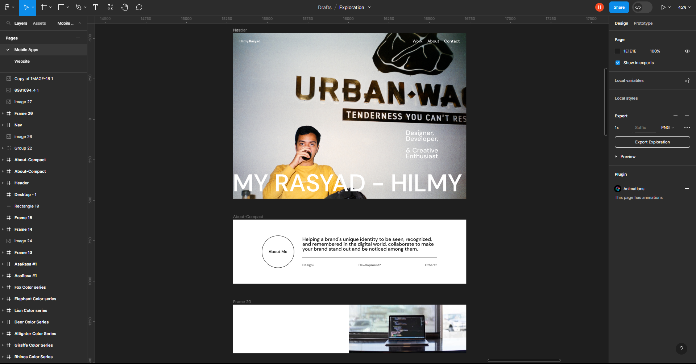
3.Create the HTML Structure and details
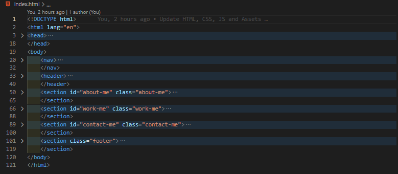
4.Working on Styling the CSS 
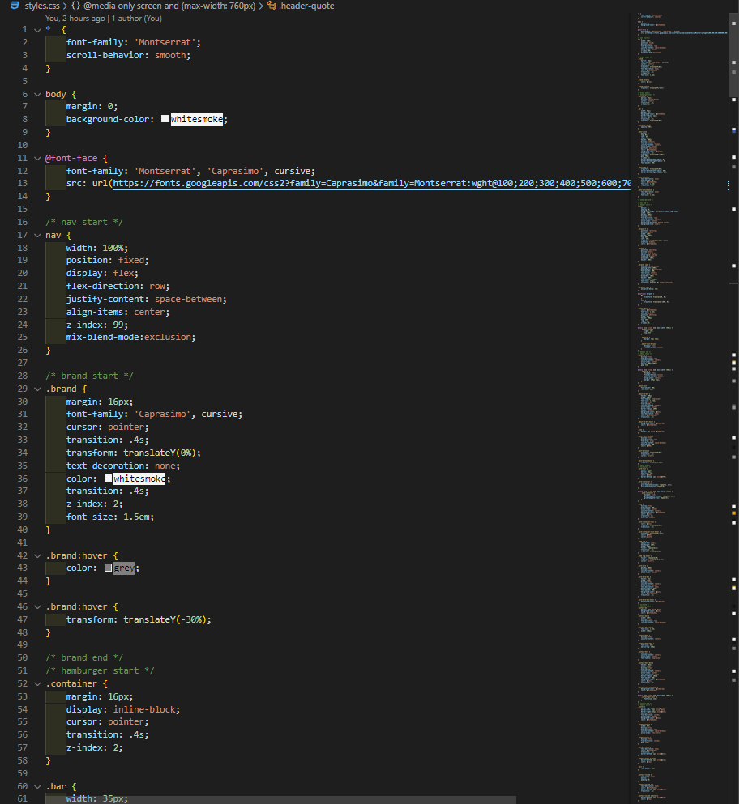
5.Script the simpe JS for better open and close nav
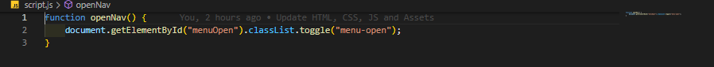

<h3>Deploy process</h3>

## Deploy to Netlify

1.Sign up/Log in to netlify for deployment.
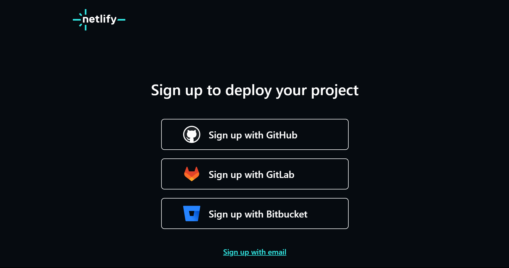 
2.Import the project by clicking <em><b>Add new site</b></em>
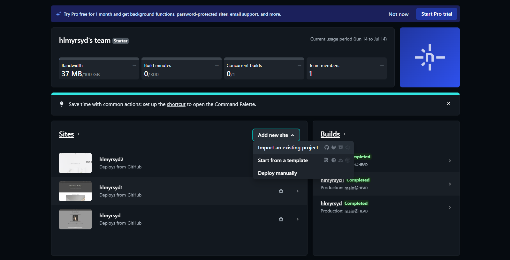 
3.deploy selected repo by following the process and then the repo can be deployed by Netlify after clicking the <em><b>Deploy ...</b></em> below.
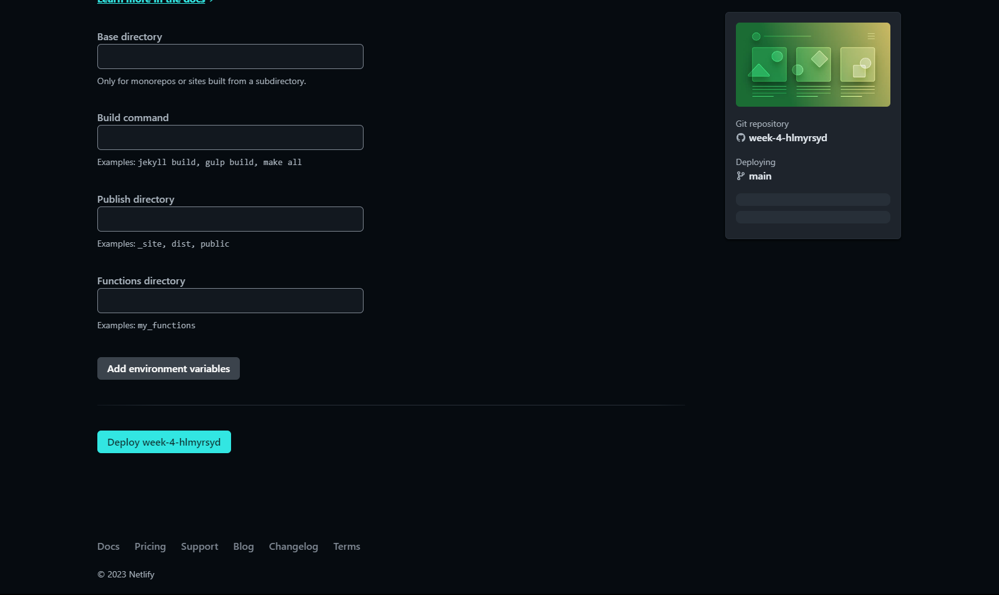 
4.<b>Tadaa! your repo is deployed!</b>
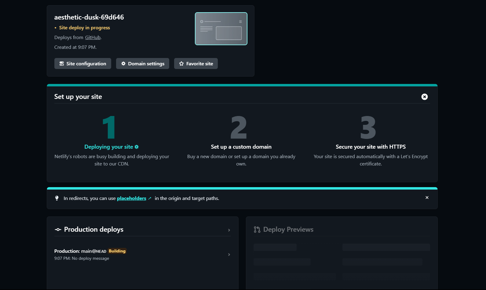 

## Set Up your SSL

1.Sign up/Log in to Cloudflare first.
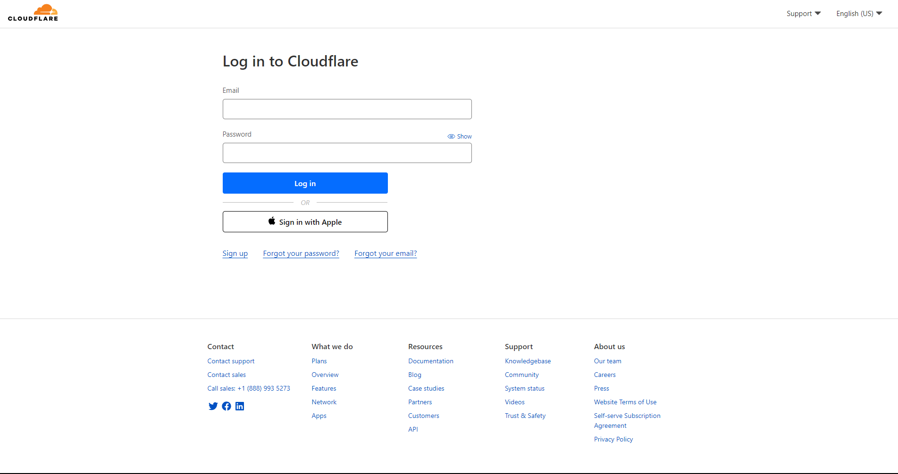 
2.Add the domain into Cloudflare
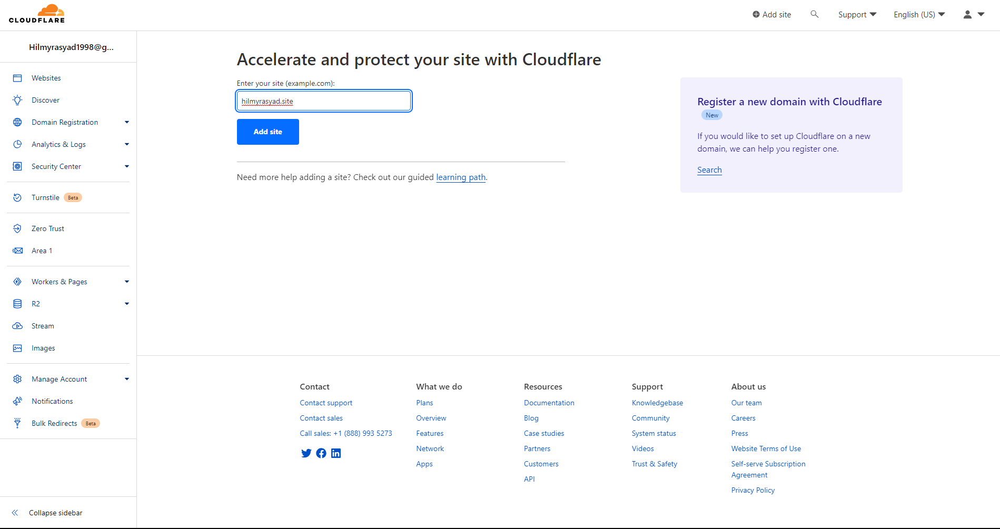 
3.copy the name server from Cloudflare into the niagahoster name server
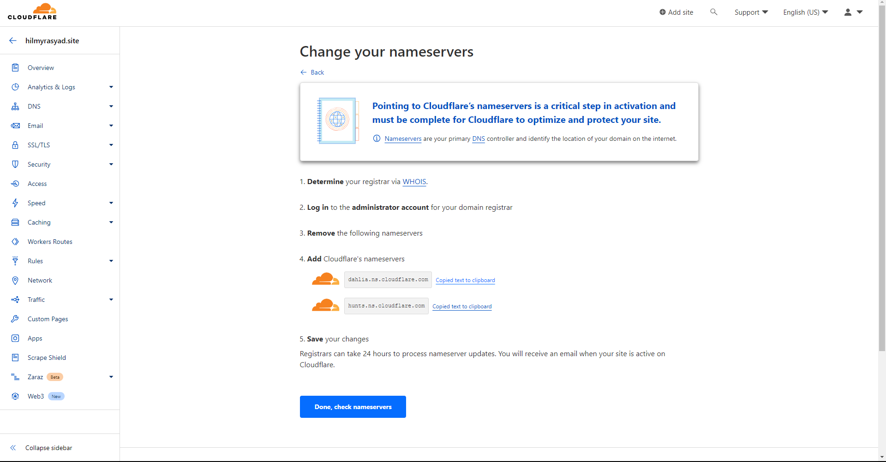 
4.There you go, the name server is updated
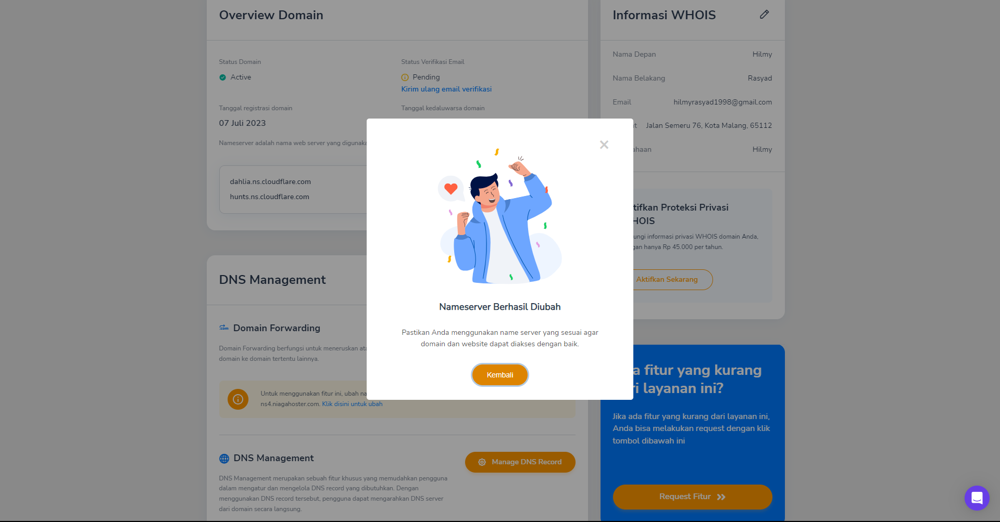 

## Changing Domain

1.Back to netlify and change your domain name into the one you purchase from niagahoster.
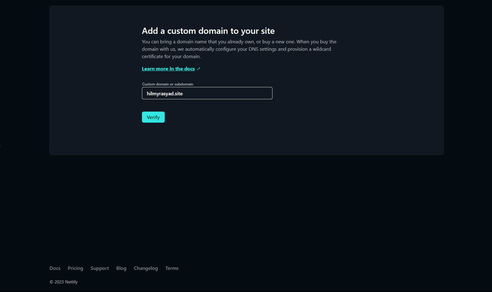 
2.There you go, Your Domain is registered in netlify!
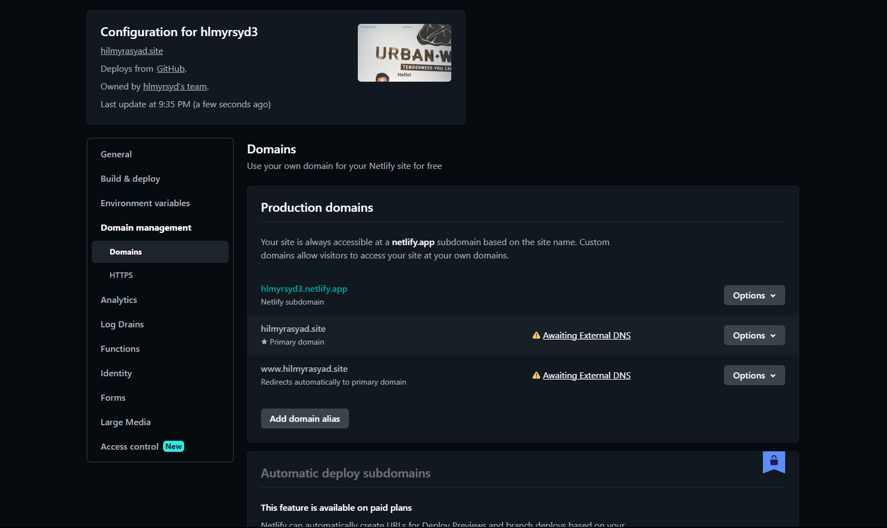 

*** 

Since you already down here, kindly checkout my other project below:
[week 1](hlmyrsyd.netlify.app)  
[week 2](hlmyrsyd1.netlify.app)  
[week 3](hlmyrsyd2.netlify.app)  
[week 4](hlmyrsyd3.netlify.app)  
[hilmyrasyad.site](hilmyrasyad.site)  

***

#Thank you! Have a nice day!